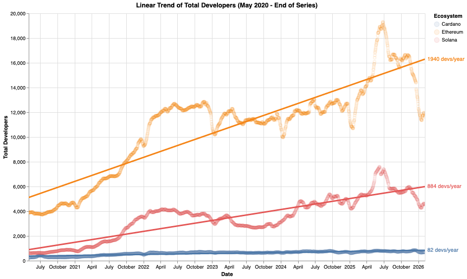
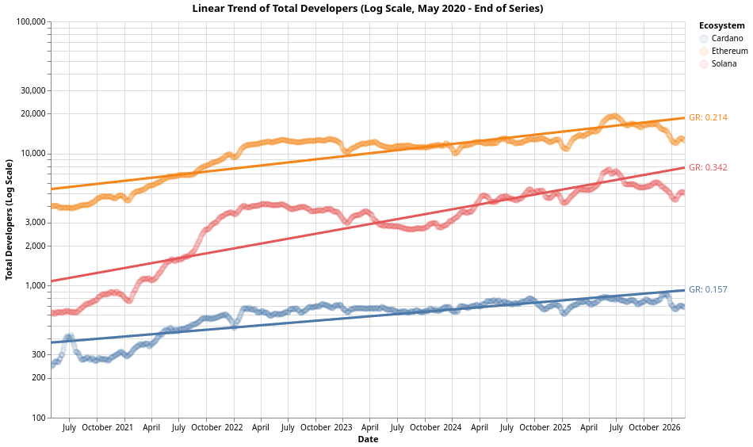
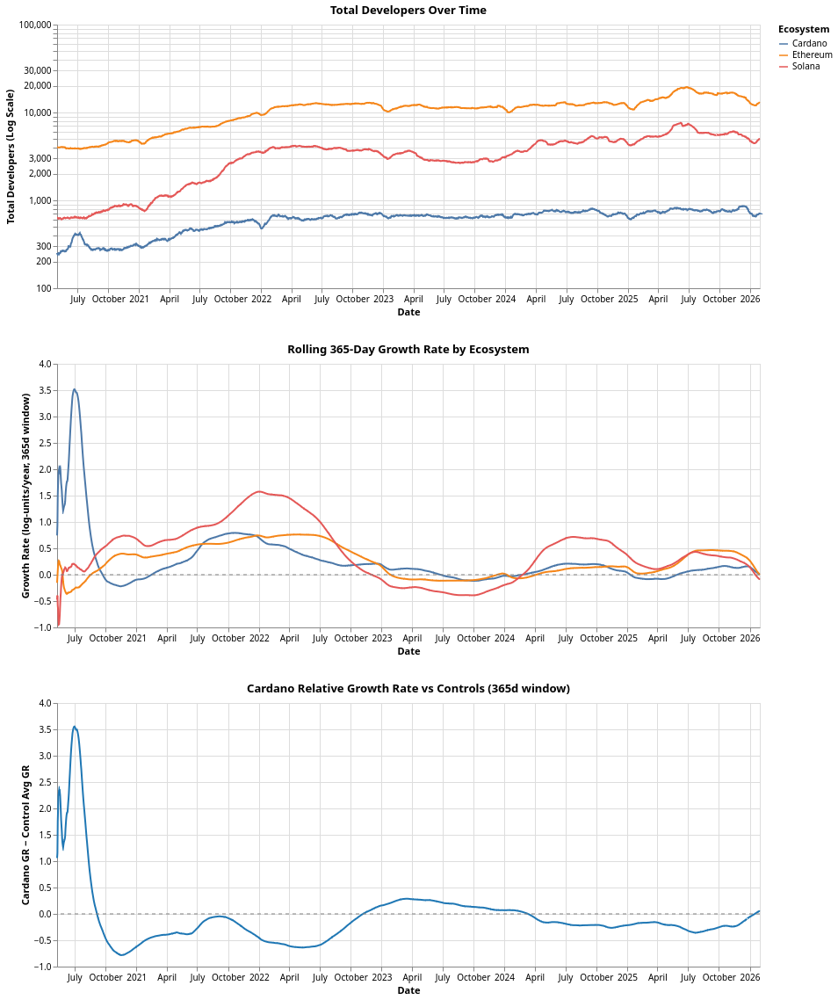
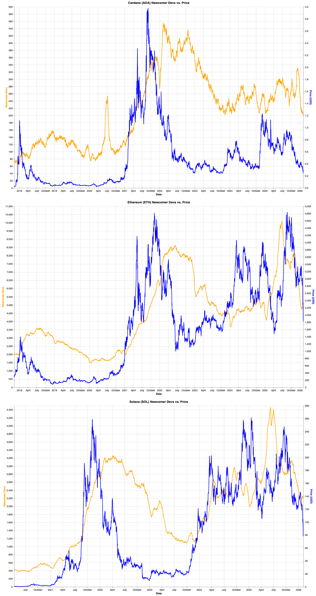
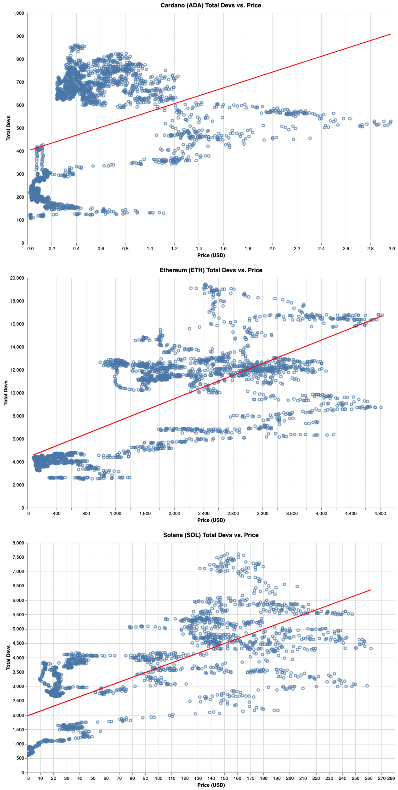

# Developer Experience Strategy for 2026/27

This repository contains an ecosystem-wide strategy to improve the DevX (developer experience) of DApp developers in Cardano. It is not an official statement from any entity, but a document used to gather feedback from the developer community and align with the companies and entities of the ecosystem that work on tooling, libraries, documentation, and other aspects that affect the DevX in Cardano.

The structure is as follows:

1. [Vision](#vision)
1. [Executive Summary](#executive-summary)
1. [Why is this strategy needed?](#why-is-this-strategy-needed)
    1. Builders are fundamental for the success of the ecosystem.
    2. Cardano has a DevX issue
    3. An ecosystem-wide strategy is needed
1. [Target Audience](#target-audience)
1. [Deliverables](#deliverables)
1. [How we will measure success](#how-we-will-measure-success)
1. [Teams that support this strategy](#teams-that-support-this-strategy)

## Vision

Make Cardano known for great developer experience across the entire Blockchain ecosystem.

## Executive Summary

**As a builder new to Cardano, I want to go from zero to an MVP on testnet in under two weeks, so that I can validate whether Cardano is the right platform for my project without a large upfront time investment.**

**Problem:** The current developer experience (DevX) on Cardano is poor and fragmented, making it difficult for new and experienced developers to build, test, and deploy decentralized applications efficiently. Friction points include (but are not restricted to) a lack of standardized tooling, non-canonical patterns and data representations, and outdated, fragmented documentation and libraries. All of which slow down development cycles and increase the barrier to entry for developers from other ecosystems (EVM, Web2). However, the underlying issue is not a lack of effort but rather misaligned incentives and a lack of an ecosystem-wide strategy.

**Solution:** The core of this proposal is to provide an ecosystem-wide strategy that allows different companies that affect DevX to align in achieving a DevX initially on par with, and eventually superior to, what EVM developers are used to. The end result is that newcomers face less friction when getting started in Cardano than in other blockchain ecosystems. We'll do this by:

- Keeping track of the current and future state of all the projects that affect DevX and help them fit in the broader context.
- Unifying and improving the onboarding and educational resources.
- Selectively contributing to the developer experience of key projects.
- Creating missing tooling.

**Why now:** The best time was years ago; the second-best time is today.

## Why is this strategy needed?

If the next statements do not convince you, open the toggles to see the reasoning behind them. We'll use both the statements and their reasoning as premises to derive the strategy.

Builders are fundamental for the success of the ecosystem

 
Unlike Bitcoin, the long-term value of Cardano and similar programmable blockchains is directly tied to the value their ecosystems provide to users. Independent of cycles, market conditions, or other factors, if something is useful, it will be used.

We call builders the people who create the products and services that end users use in the ecosystem. They are the ones who attract end users to the ecosystem, and, in the long run, they are the ones who make it successful.

As such, builders are the foundation of a useful ecosystem, and we need a strategy that accommodates their needs.

Cardano has a DevX issue

 
The next information is based on:

- **Electric Capital's [Open Dev Data](https://opendevdata.org/about)**: An open source dataset that provides the crypto industry with a single source of truth for measuring developer activity, with a cutoff date of January 2026.
- **Cardano Foundation's [Developer Survey of 2025](https://cardano-foundation.github.io/state-of-the-developer-ecosystem/2025)**: With responses from a significant portion (109) of the developers on up to 36 questions, the 2025 survey offers valuable insights into the needs and experiences of those building on Cardano.

### Developer activity: Cardano vs Ethereum and Solana

We'll compare Cardano with Ethereum and Solana because they are currently the closest competitors. There's a huge gap between Cardano, Ethereum, and Solana across any metric related to developer activity:

| Developer Category                | Cardano | Ethereum | Solana | Eth/Cardano | Sol/Cardano |
| --------------------------------- | ------- | -------- | ------ | ----------- | ----------- |
| All developers                    | 678     | 11,624   | 4,519  | 17.1x       | 6.7x        |
| One-time developers               | 55      | 1,624    | 787    | 29.5x       | 14.3x       |
| Part-time developers              | 355     | 6,234    | 2,510  | 17.6x       | 7.1x        |
| Full-time developers              | 268     | 3,766    | 1,222  | 14.1x       | 4.6x        |
| New Developers (0-1 year)         | 199     | 4,650    | 2,177  | 23.4x       | 10.9x       |
| Emerging Developers (1-2 years)   | 101     | 1,578    | 622    | 15.6x       | 6.2x        |
| Established Developers (2+ years) | 378     | 5,396    | 1,720  | 14.3x       | 4.6x        |

From this table, we can see that not only Eth and Sol have 17.1x and 6.7x (respectively) more developers than Cardano, but also that new developers are 23.4x and 10.9x more likely to choose Ethereum or Solana over Cardano, and new contributors are 29.5x and 14.3x more likely to choose Ethereum or Solana over Cardano.

That's the current state, but what about the evolution in time? The next chart shows the growth of developers since May of 2020 (when we started to have data for Solana):

We can see that:

- Cardano is the only blockchain with almost no growth in the last ~6 years (82 devs/year on average).
- On average, Ethereum grows by 1940 devs/year (almost 3x the TOTAL amount of developers in Cardano) while Solana grows by 884 devs/year (1.3x the TOTAL amount of developers in Cardano).

Even if we take the natural log of population sizes to directly represent the continuous proportional growth rate (enabling easier comparison of growth trends across ecosystems), we still see that both Eth and Sol would grow faster than Cardano if starting with the same number of developers:

This helps, however, fitting one log-linear regression across the entire period (May 2020 - present) and producing a single GR number per ecosystem is misleading because:
- **Solana** had explosive early growth (2021-2022) then flattened. Its GR of 0.342 is dominated by the early surge and doesn't represent current dynamics.
- **Ethereum** plateaued around mid-2022 and has been roughly flat since.
- **Cardano** shows steadier growth throughout.

A single trend line masks structural breaks which is exactly the kind of regime change we'd want to detect.

So, instead of one GR per ecosystem, we compute a GR time series using a 365-day sliding window. For each data point, we fit `ln(devs) = slope * t + intercept` over the trailing 12 months. The slope (converted to per-year) gives the instantaneous growth rate at that point in time.

This lets us:
- See how GR changes over time for each ecosystem
- Spot when growth accelerated or decelerated
- Check whether ecosystems move in parallel

Then, we compute `GR_cardano - avg(GR_ethereum, GR_solana)` at each point in time. This is the core metric for a [difference-in-differences](https://en.wikipedia.org/wiki/Difference_in_differences) style analysis.

- **Above zero**: Cardano is growing faster than the control ecosystems.
- **Below zero**: Cardano is growing slower.
- **A sustained upward shift after an intervention**: evidence that the intervention had a positive effect.

The control ecosystems absorb market-wide effects (crypto winter, bull runs, regulatory changes). What remains after subtracting their change is more attributable to Cardano-specific actions. And that's how we obtain the next three charts:
1. **Developer Counts (log scale)** — Raw data as lines with logaritmic scale to be able to compare them (otherwise Cardano's variance is too small).
2. **Rolling 365-Day GR** — Growth rate over time for each ecosystem.
3. **Cardano Relative GR vs Controls** — A DiD-ready chart to be used as overall view of our current state and to be used as baseline to assess this proposal's impact. We'll compare the relative GR before and after implementing this proposal to see the results. If efective, the relative GR should shift upward after that line. The more the better.

The key graph to look at is the last one. In that graph, having 0 relative GR means we grow equally to Ehtereum and Solana. With the huge difference in total amount of developers between Cardano and the others, **Cardano having 0 relative growth rate is very bad** because it means Ethereum and Solana will keep growing by thousands of developers/year while we add less than a hundred/year. Over time, gap between them and Cardano gets bigger and bigger, and harder and harder for us to compete. So **our ideal scenario is sustained positive relative growth rate (the higher, the better)** to, slowly but surely, catch up with them over many years.

There are some caveats:
- **Confounders**: Other ecosystem-specific events around the same time can pollute the signal of this specific proposal.
- **Lag**: Developer ecosystem changes take time. We may need to wait 3-6+ months post-implementation to see effects.
- **Low R-squared windows**: If the exponential model fits poorly in a given window, that GR estimate should be interpreted cautiously.

Also, this metric is not only affected by DevX but also by positioning, marketing, and other factors. So, by itself, it doesn't necessarily suggest that Cardano has a weak DevX. But it's a valuable datapoint to use in conjunction with the ones presented next.

### Developers VS Token Price

The difference in developers is not **_only_** a matter of "token go up, developer activity goes up". We can explore that in the following chart, which shows the number of *new* developers vs token price for all three ecosystems:

One thing to notice is that there's a slight delay between token price and new developer activity. Both going up and going down. And that the ecosystem that manages to retain developers after the token price drops might carry a significant advantage over the rest.

However, even if there is a clear correlation, it's far from being a 1:1 relationship. To highlight this, here's a direct comparison between the number of *total* developers (new and established) and price with a linear regression to highlight the relationship:

As we can see, the number of developers (both new and established) is highly correlated with price in the long term (years), somewhat in the mid term (months), and not so much in the short term (weeks).

This is consistent with our understanding of incentives and value generation:
- Token price variability in the short term doesn't yield meaningful developer reaction, since it's not an attractive foundation to build upon.
- Once the token has proven to have sustained value, the number of developers increases to build products and services, trying to capture some of that value.
- In the long run, the average utility of the ecosystem increases, which serves as a catalyst to both increasing price and the number of developers.

### Developer survey results

The developer survey results are an even stronger indicator of the DevX issue. It's worth reviewing the survey results in detail to understand the full picture, but here we'll present the most relevant points:

- **Over 60% of respondents report 7+ years of software engineering experience, with another 25% in the 2–7 year range.** Early-career developers remain a minority, consistent with 2024. Compared with broader industry benchmarks such as the Stack Overflow Developer Survey, **the Cardano ecosystem remains significantly more senior than average**". This suggests that Cardano **is not appealing** to newcomers.
- When asked "What should be the biggest priority on the Cardano technical roadmap?", the options with the second and third highest rankings (behind higher-throughput) were "Better documentation and explainers" and "Accessibility & use cases enablers". **Suggesting that lack of proper documentation and explainers is a big concern, and that there's a significant barrier to implementing use cases.**
- When asked "How satisfied are you with the current state of the smart contract ecosystem?", the median satisfaction score was 7 with a tight interquartile range (6–8), **suggesting writing smart contracts themselves is not perfect but acceptable, and that the DevX issues are likely elsewhere (e.g., testing, debugging, and transaction ergonomics, etc.)**
- Answers to "It would be nice if there were a CLI for..." show that requests for new CLI tooling in 2025 consistently point toward higher-level, end-to-end workflows rather than additional low-level primitives. Consistent with the need for friendlier interfaces and better DevX.
- Answers to "On average, how satisfied are you with the technical answers/details you find in documentation and within the community?" provide a median score of 7 with a notably tight interquartile range (6–7). **This suggests moderate satisfaction coupled with broad agreement, indicating that most developers converge on a "good enough, but not great" assessment of technical answers.** The narrow spread also suggests that frustrations with documentation quality and answer depth are widely shared rather than confined to specific subgroups. **It's important to note that this question combines documentation and community answers, making it hard to tell which (if any) is doing most of the work**. It's important because documentation is always available and more reliable than having community members answer questions. Ideally, documentation should do most (if not all) of the work.
- When asked "What do you think is the biggest pain point of Cardano's developer ecosystem?", we get a lot of insights, but for this brief, we'll limit ourselves with the final comment: **"The dominant pain points expressed in 2025 cluster around developer experience rather than protocol capability, with fragmentation of tooling, weak off-chain/on-chain integration, and the absence of mature transaction-building abstractions recurring across responses. Compared to 2024, the emphasis shifts from documentation alone toward a broader critique of ecosystem cohesion: duplicated efforts, unclear "blessed paths," and insufficiently maintained libraries amplify the already steep eUTxO learning curve. In contrast to ecosystems like Ethereum—where complexity is often hidden behind opinionated frameworks—Cardano developers still shoulder much of the architectural burden directly, slowing onboarding and experimentation despite strong underlying primitives".**

### Conclusion

By considering all the insights discussed previously, it's safe to conclude that Cardano's DevX needs to improve to allow for an increase in the number and retention of developers in the ecosystem. We can't force developers to try Cardano, but we can make it so easy to onboard and maintain their software that those who do have no reason to leave. This is especially true if we want to help adoption by non-senior developers, who constitute the majority of developers outside our ecosystem.

An ecosystem-wide strategy that aligns the efforts of the different actors in the ecosystem is needed

 
Based on what we discussed in the previous point, we know the biggest issues with DevX are:

- Lack of tooling integration and ecosystem cohesion paired with insufficient coordination.
- Fragmented, immature, and unmaintained tooling, libraries, and documentation.
- Lack of plug-and-play libraries, friendly abstractions, reference implementations, and developer support.

If the problem were localized to a specific tool, documentation, or library, it'd make sense to invest most of our effort in improving those. However, the developer ecosystem is so varied and constantly changing that our best bet is to embrace that diversity.

That's why we need an ecosystem-wide strategy: there's no single entity, tool, or website with enough developer share, and **we need to work together** to improve Cardano's overall DevX.

## Target Audience

Our target will eventually be all developers. However, we should focus on increasing the number of developers as much as possible at first. So, our priority should be to favor new, less experienced developers over existing, more experienced ones.

| Description | Why them? | They need to.. | Today, they struggle with.. | Success for them means | 
|-------------|-----------|----------------|-----------------------------|------------------------|
| Junior EVM developers | They are the easiest to onboard. They just need to learn the differences between building on EVM and eUTxO, and the practical details of our tooling. | Get a job. Integrate (or replicate) their existing DApp in Cardano. | The initial steps of the development cycle. Adapting EVM architecture to eUTxO. | Being able to implement any EVM protocol in Cardano. |
| Junior Web developers | They are the most cost-effective segment. They need to learn blockchain in general and Cardano in particular, but their existing web development skills and knowledge speed up the rest of the process, and they are a large enough group to warrant our efforts. | Get a job | Virtually every step of the development cycle. | Being able to build simple DApps to add to their portfolio. Being able to prove they can build on Cardano. |
| Technical entrepreneurs | They are the ones starting new projects and hiring developers. | Evaluate the advantages, disadvantages, and costs of building on Cardano. | Creating an MVP, identifying the advantages of Cardano over other ecosystems, and onboarding developers. | Being able to build their MVP in approximately the same time it would take in any other ecosystem. Having a clear idea of why to choose Cardano. |

**The overlap in needs between these segments is so high that *most* of the work doesn't need to be targeted to one or the other.**

## Deliverables

This is the list of proposed deliverables. All of them require multiple outputs and workstreams, as described in their respective files; this table provides only a brief overview.

| Item | Overview | Outcome |
| ---- | -------- | ------- |
| [Community Alignment and Collaboration](./deliverables/alignment.md) | The most important deliverable. Align the ecosystem around a shared DevX vision by mapping all tooling, libraries, and documentation. Identify gaps and overlaps, then actively contribute to community tooling, deduplicate documentation, and help maintain key libraries. | A healthier and less fragmented developer ecosystem. |
| [Setup CLI](./deliverables/setup-cli.md) | A Setup CLI/TUI to easily start DApp projects — a Create T3 Stack/TanStack Builder for Cardano. Users can pick any desired stack combination, get algorithmic tool recommendations, an AI/LLM-native project setup, and automatic dependency installation. | A single entrypoint for new developers, regardless of tooling choice, with better visibility into developer activity and preferences. |
| [Developer HUB](./deliverables/developer-hub.md) | Create (or contribute to) a single, authoritative entry point for new Cardano developers — prime candidate is developers.cardano.org. Define clear user paths (EVM dev, Web2 dev, Technical entrepreneur), keep content always up to date via CI/CD and periodic reviews, and ensure it is AI/LLM-native. | A source of truth for Cardano development documentation that is easy to follow, up to date, complete, and LLM-friendly. |
| [OpenZeppelin-like Library](./deliverables/openzeppelin.md) | Design and implement a library of standardized, reusable smart contracts (on-chain and off-chain) with an emphasis on DeFi primitives. Create the infrastructure, website, and ship at least 5 ready-to-audit contracts (e.g., Vesting, DEX, Lending). | Significantly reduced time and risk involved in building on Cardano through canonical implementations of common use cases. |
| [Developer Outreach](./deliverables/outreach.md) | A multichannel developer outreach program: live streams and video tutorials, a build club providing technical support to new teams (with public recordings), and a Discord channel for developer engagement and routing. | New builders always have a way to get unstuck when getting started, improving developer retention as they explore Cardano. |
| [AI/LLM Native](./deliverables/llms.md) | Make the ecosystem AI/LLM-native by adding standardized llms.txt files to documentation resources, providing MCP servers for integrated doc access, and creating Agent Skills for common development workflows. | Developers face no friction using LLMs to assist their development on Cardano. |
| [Reactive and Exploratory](./deliverables/reactive.md) | A catch-all for reactive and exploratory measures: low-hanging fruit or high-ROI opportunities that surface during implementation. Examples include canonical CBOR representation, CBOR analyzer tools, improved node error messages, no-code transaction builders, and new DevX CIPs. | Ability to quickly react to developer demands and explore (then implement or discard) ideas to improve DevX. |

## How we will measure success

Developer experience is a complex, abstract concept, and there's no single metric to measure it. However, we can combine several metrics to obtain a good approximation. That's why we'll measure success by combining and interpreting the next metrics.

### Proxy metrics

<bold>Metrics relative to the blockchain ecosystem</bold>

 
We use metrics relative to the overall blockchain ecosystem and direct competitors (Ethereum and Solana) to control for industry-wide trends. This is important to avoid attributing success or failure to the strategy when it's actually due to changes in blockchain regulations, market conditions, or other unrelated industry-wide factors.

We'll use the same methodology we used to analyze if Cardano has a DevX issue (relative growth rate using difference-in-differences technique) to analyze these three metrics:

- The relative growth rate of new developers increases by at least 30% compared to the baseline.
- The relative growth rate of new DApps/projects increases by at least 30% compared to the baseline.
- The relative growth rate of new contracts deployed on Cardano Mainnet increases by at least 30% compared to baseline.

<bold>Metrics relative to past years</bold>

 

We use past performance to set the baseline for the metrics.

- Results of the Cardano Foundation's Developer Survey indicate that the developer experience has improved.

### Direct metrics

<bold>Run an experiment to directly assess the onboarding difficulty</bold>

 

The main metric to measure success is how hard it is to onboard a new developer to Cardano. We propose to measure it directly by delivering two hackathons with these characteristics (one before and one after the strategy is implemented):

- Online event (to cut costs and reach a wider audience)
- Two weeks to build a specific project.
- We'll promote the hackathon in other ecosystems without revealing that it's a Cardano hackathon.
- We'll offer an economic incentive (a prize of e.g. $10,000) and help to go from MVP to real product to the winner.
- We'll vet the candidates (they have to be unfamiliar with Cardano and have a solid understanding of web development and/or blockchain development).
- We'll provide links to existing documentation, tooling, and libraries, but no other support. They have to figure it out on their own.
- The project will be:
    - Secret until they start building it.
    - Something necessary for the ecosystem to grow.
    - Something that could be built by a single developer *familiar* with Cardano in one week of full-time work. That leaves one week for the developer to learn Cardano and the ecosystem.
    - Thoroughly described to avoid ambiguity, and we'll require both the smart contract design and on-chain + off-chain (transaction building) implementation.
- We'll interview all participants as soon as they finish to get feedback on the experience and to gather insights on the developer experience. We'll use a set of predefined qualitative and quantitative questions (same for both hackathons).
- We'll evaluate the projects to see how far they've gone and how much they learned.

We'll use interviews, code reviews, and feedback to estimate the time and effort required to onboard a new developer to Cardano. Then, we'll compare the results of the two hackathons to estimate the difference in overall developer experience.

## Teams that support this strategy

**What does support mean?:** If a team chooses to "support" this strategy, it means they agree with the overall problems and solutions presented. It doesn't mean they'd have to provide resources or that they commit to contribute to it. The objective of this list is to gauge alignment within the development ecosystem. And, of course, if there are things we should add/change/remove, issues and PRs are open!

> [!NOTE]
> This strategy is in active development. If a builder adds themselves to this table and then non-trivial changes are made to this proposal, we'll notify the representative to verify they still support this strategy. If there's no response, that specific representative will be pinned to the last supported version (commit).

| Team/Company | Representative |
|--------------|----------------|
| IOG's Cardano Business Unit| [@rober-m](https://github.com/rober-m) (PM of Developer Experience) |
