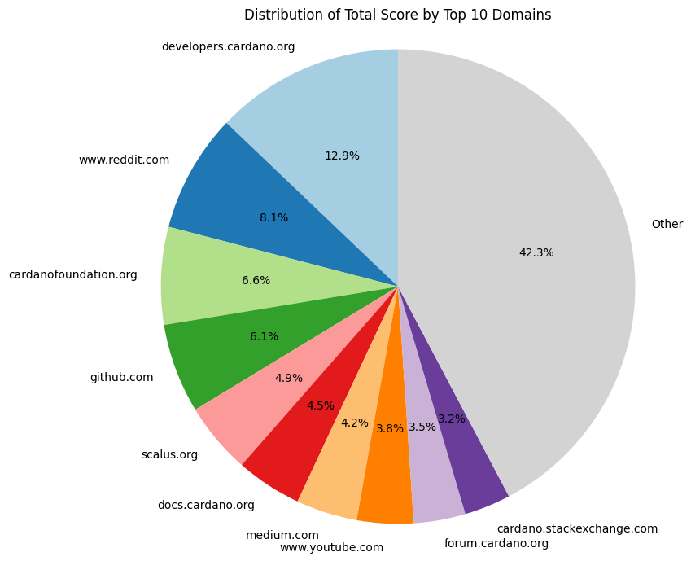

# Developer HUB

## Dependencies

[Community alignment](/deliverables/alignment.md)

## Description 

We'll "create" a well-structured and complete entry point for new Cardano developers. We put "create" in quotes because, for SEO and LLM-related reasons, the ideal scenario is to contribute to an existing, popular website rather than creating a new one. The objective is to have a single, authoritative entry point for developers new to Cardano that consolidates and organizes onboarding content for three key user paths: EVM developer, Web2 developer, and Technical entrepreneur.

The prime candidate is [Cardano Foundation's Developer Portal](https://developers.cardano.org). This is because we did an analysis where we searched 50 queries related to getting started with developing on Cardano, and this website was the one that ranked the highest consistently:

> NOTE: The relative "score" of each website is calculated by:
>
> $$P_d = \frac{\displaystyle\sum_{i \in d} (10 - R_i)}{\displaystyle\sum_{i=1}^{N} (10 - R_i)} \times 100\%$$
>
>  where the numerator sums the scores for all entries belonging to a specific domain $d$, the denominator sums the scores across all $N$ entries in the dataset, and $R_i$ is the ranking (relative position from 1 to 10) of the domain in the list of results for a query $i$.

However, there's a lot of work to be done for this (or any other) website to be effective at onboarding developers. There are no clear paths to follow, the documentation is not optimized for onboarding, and the content is outdated or incomplete in many places.

### Key aspects of this developer entrypoint

- **Clear user paths:** The entry point will allow people to choose the path that best fits their profile, and we'll present the content in a way optimized for the user. For example, the path for Web2 developers will contain a short overview of key blockchain-related concepts, but the path for EVM developers won't. This also means that content that doesn't align with any of the user personas will be deprioritized or moved to a different place (e.g., information on how to become an SPO). 
- **Tailored for onboarding:** Correctly presenting a new subject requires a subtle balance in the depth, order, and the way information is presented. For example, introducing the syntax of UPLC to web developer as one of the first things to learn is far from ideal. However, presenting the key differences (while avoiding too much detail at first) between the eUTxO and Account models to an EVM developer is a great idea. To increase the rate of conversion, we have to optimize for low-effort progress.
- **Covering concepts, not tools:** We'll have to explain tools and libraries for it to be practical and useful. However, we'll aim to make it as generic as possible. This is both to allow for an easier-to-maintain site (less likely to get out-of-date), and to serve as a springboard to tooling-specific documentation. For example, when covering smart contracts, we'll be mindful to keep most of the explanation generic and to allow code snippets to be presented in more than one language. Then, if the user is interested in a specific on-chain language, links to their documentation will be easy to spot. By doing that, for us, if the currently most used language/tool/library goes out of fashion, only the snippets need to be updated. For tooling/library/service developers, they only have to maintain documentation specific to their offering, reducing the burden on their side.
- **Complete documentation:** It will also serve as the central location for design patterns, best practices, and advanced documentation content. As long as the information is useful and generic enough for our target audiences, it should live here. Of course, we'll properly manage the complexity levels by hiding certain information from newer developers until they are ready.
- **Always up to date:** Besides making the content as evergreen as possible, we'll integrate a CI/CD pipeline to ensure that all code snippets and examples remain functional and up-to-date as the ecosystem evolves. This doesn't only apply to implementation but also to conceptual knowledge. As Cardano evolves, new best practices, patterns, etc., emerge. This site will reflect the latest on DApp and smart contract development. For example, once CIP-118 and CIP-159 are introduced, many patterns and best practices will change and new ones will arise.
- **Source of truth:** Another key aspect is for this to be adopted as a "source of truth" for DApp development in Cardano. We believe that by addressing all those previous points, other resources (courses, workshops, etc.) would link our documentation as the place to learn more about development. Which ties nicely with our next point.
- **AI/LLM-native:** We can't deny the usefulness of having an LLM assist with researching documentation. That's why we'll make sure everything the developer has available to consult is also available to their LLM. For example, adding `llms.txt` files.

## Outcome

The outcome is a source of truth for generic documentation about how to develop on Cardano that is easy to follow, up to date, complete, and LLM-friendly. The expected outcome is an increase in developers who move past the "just browsing" stage and quickly become able to create nontrivial DApps.
