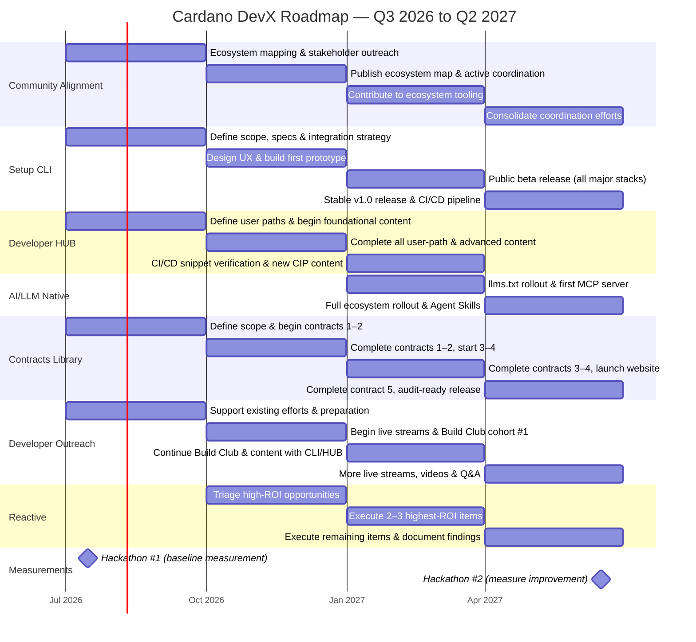

# Cardano DevX Roadmap — Q3 2026 to Q2 2027

## Overview

This roadmap covers the execution of the Cardano Developer Experience strategy across four quarters. The goal is to measurably improve Cardano's developer growth rate by at least 30% relative to Ethereum and Solana, and to enable new Cardano developers to go from zero to a testnet MVP in under two weeks.

Deliverables are sequenced to respect dependencies: **Community Alignment** is foundational and must run first, since the **Setup CLI**, **Developer HUB**, **AI/LLM Native**, and **Reactive** tracks all depend on its outputs. **ContractsLibrary** and **Developer Outreach** can start independently in parallel.

Impact on direct metrics will be measured in **June 2027**. Impact on indirect metrics will be measured in **November 2027** after enough time has elapsed for the deliverables to influence developer activity.

---

## Dependency Map

```
Community Alignment ──┬──► Setup CLI ─────┬──► Developer Outreach (full activation)
                      ├──► Developer HUB ─┴──► AI/LLM Native
                      └──► Reactive      

ContractsLibrary (independent)
Developer Outreach — Initial phase
```

---

## Timeline summary



---

## Roadmap

### Q3 2026 — Foundations

**Theme:** Lay the groundwork. No deliverable can succeed without understanding the current ecosystem and aligning stakeholders around a shared vision.

| Deliverable | Work |
|---|---|
| **Community Alignment** | Map all ecosystem tooling, libraries, and documentation. Identify gaps and overlaps. Begin outreach and coordination with key projects (Aiken, MeshJS, Tx3, CF, etc.). |
| **Developer HUB** | Finalize the contribution strategy for developers.cardano.org. Define the three user paths (EVM developer, Web2 developer, Technical entrepreneur). Begin writing foundational content. |
| **Setup CLI** | Define scope, specs, and plugin/project integration strategy. |
| **ContractsLibrary** | Define scope, library architecture, and infrastructure. Identify the first 5 target contracts. Begin development of contracts 1–2. |
| **Developer Outreach** | Support existing efforts (e.g., answer questions in Discord) and prepare for future endeavors until we have Developer HUB and Setup CLI ready. |
| **Hackathon #1** | Run the first controlled experiment. Use results as the baseline measurement for onboarding difficulty. |

---

### Q4 2026 — First Outputs

**Theme:** Ship the first user-facing outputs based on ecosystem alignment findings.

| Deliverable | Work |
|---|---|
| **Community Alignment** | Publish the ecosystem map. Begin active coordination: deduplicate documentation across sources, connect existing docs, support key library maintainers. |
| **Developer HUB** | Complete all user-path content. Add advanced content and design-pattern documentation. Ensure content reflects new CIPs (CIP-118, CIP-159, etc.) as they land. |
| **Setup CLI** | Design the CLI/TUI UX and tool-ranking algorithm. Build the first working prototype that bootstraps a project with at least two stacks. |
| **ContractsLibrary** | Complete contracts 1-2, start working on contracts 3-4. |
| **Developer Outreach** | Begin live streams. Establish the Build Club structure and onboard the first cohort of new teams. |
| **Reactive** | Begin tracking and triaging high-ROI reactive opportunities identified during alignment work. |

---

### Q1 2027 — Core Deliverables Ship

**Theme:** The main developer-facing tools reach a usable state.

| Deliverable | Work |
|---|---|
| **Community Alignment** | Ongoing coordination. Begin contributing directly to ecosystem tooling (LSPs, editor extensions, TUIs). |
| **Setup CLI** | Public beta release. Covers all major stacks. Includes `AGENT.md` generation, MCP/Skill scaffolding, and links to documentation and community resources. Anonymous opt-in statistics are ready. |
| **Developer HUB** | CI/CD pipeline for snippet verification is active. Ensure content reflects new CIPs (CIP-118, CIP-159, etc.) as they land. Use Setup CLI for explanations when starting a new project. |
| **AI/LLM Native** | Add `llms.txt` to Developer HUB and begin rollout to major DApp developer ecosystem tools (Aiken, MeshJS, Tx3). Publish the first MCP server for Cardano developer documentation. |
| **ContractsLibrary** | Complete contracts 3–4. Begin contract 5. Launch the library website and infrastructure. |
| **Developer Outreach** | Continue Build Club. Live stream content and videos begin to cover and use the new CLI and HUB. |
| **Reactive** | Execute on 2–3 highest-ROI items identified in prior quarters (e.g., CBOR analyzer, node error translation layer, or CIP drafts). |

---

### Q2 2027 — Completion

**Theme:** Complete all deliverables, fill gaps, and harden outputs based on real-world developer feedback.

| Deliverable | Work |
|---|---|
| **Community Alignment** | Consolidate coordination efforts. |
| **Setup CLI** | Stable v1.0 release. Address feedback from beta. Create a CI/CD pipeline to ensure all stacks are up to date with the latest ecosystem tooling. |
| **AI/LLM Native** | Full `llms.txt` rollout across the ecosystem. Agent Skills are published for the most common development workflows (testing contracts, updating dependencies). MCP servers expanded when/if needed. |
| **ContractsLibrary** | Complete contract 5. All 5 contracts are ready to audit. Documentation and website are complete. The library publicly announced. |
| **Developer Outreach** | More live streams, videos, and explanations. Keep answering questions on all channels until the end of the quarter. |
| **Reactive** | Execute remaining reactive items. Document exploratory findings — which ideas were pursued, which were discarded, and why. |
| **Hackathon #2** | Run the second controlled hackathon under the same conditions as Hackathon #1. Compare results to measure improvement in onboarding effort and developer experience. |

---
## Success Metrics

### Direct metrics — measured June 2027

| Metric | Target |
|---|---|
| Hackathon onboarding effort (zero to testnet MVP) | Reduction vs Hackathon #1 |
| CF Developer Survey — DevX satisfaction scores | Measurable improvement |

### Indirect metrics — measured November 2027

Indirect metrics require more time to reflect in on-chain and ecosystem-wide data. Measured ~5 months after all deliverables ship to allow sufficient lag for ecosystem effects.

| Metric | Target |
|---|---|
| Relative new-developer growth rate (vs Eth/Sol, DiD) | +30% vs baseline |
| Relative new DApp/project growth rate (vs Eth/Sol, DiD) | +30% vs baseline |
| Relative new contracts deployed on Mainnet (vs Eth/Sol, DiD) | +30% vs baseline |

