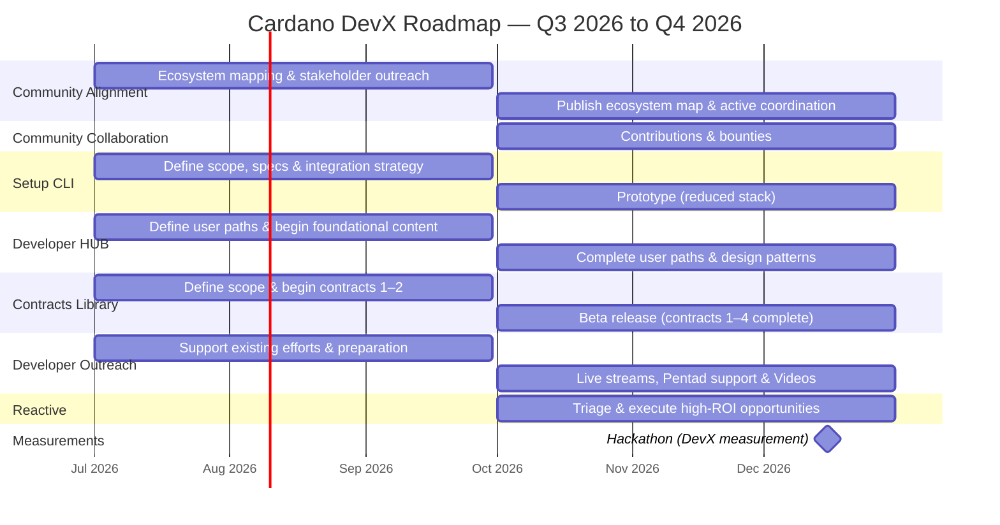
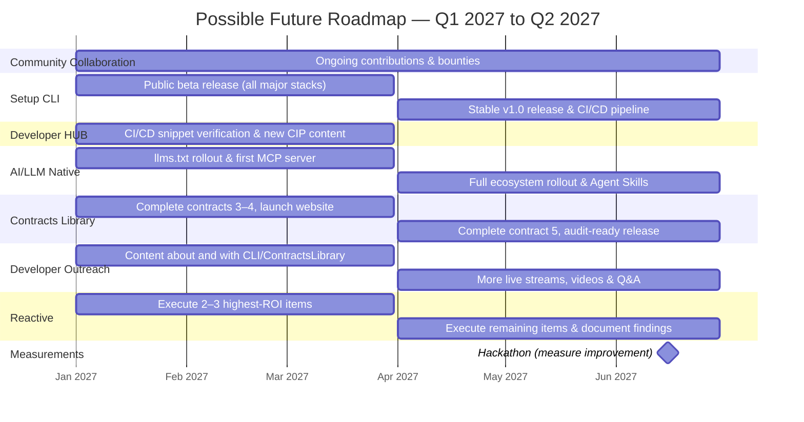

# Cardano DevX Roadmap — Q3 2026 to Q4 2026

## Overview

This roadmap covers the execution of the Cardano Developer Experience strategy across two quarters. The goal is to measurably improve Cardano's developer experience, and to enable new Cardano developers to go from zero to a testnet MVP in under two weeks.

Deliverables are sequenced to respect dependencies: **Community Alignment** is foundational and must run first, since the **Setup CLI**, **Developer HUB**, and **Reactive** tracks all depend on its outputs. **ContractsLibrary** and **Developer Outreach** can start independently in parallel. **Community Collaboration** begins in Q4 once alignment work has identified which gaps are worth funding.

A possible continuation of this work in 2027 is described in the [Addendum](#addendum-possible-future-roadmap-q1-q2-2027).

---

## Dependency Map

```
Community Alignment ──┬──► Setup CLI
                      ├──► Developer HUB
                      └──► Reactive

Community Alignment ──► Community Collaboration (Q4)

ContractsLibrary (independent)
Developer Outreach — runs throughout
```

---

## Timeline Summary



---

## Roadmap

> [!NOTE]
> In the case we finish the work in this roadmap before Dec 2026, we'll either keep working on the roadmap in the Addendum or return the money to the treasury.

### Q3 2026 — Foundations

**Theme:** Lay the groundwork. No deliverable can succeed without understanding the current ecosystem and aligning stakeholders around a shared vision.

| Deliverable | Work |
|---|---|
| **Community Alignment** | Map all ecosystem tooling, libraries, and documentation. Identify gaps and overlaps. Begin outreach and coordination with key projects (Aiken, MeshJS, Tx3, CF, etc.). |
| **Developer HUB** | Finalize the contribution strategy for developers.cardano.org. Define the three user paths (EVM developer, Web2 developer, Technical entrepreneur). Begin writing foundational content. |
| **Setup CLI** | Define scope, specs, and plugin/project integration strategy. Proof-of-concept done. |
| **ContractsLibrary** | Define scope, library architecture, and infrastructure. Identify the first 5 target contracts. Begin development of contracts 1–2. |
| **Developer Outreach** | Support existing efforts (e.g., answer questions in Discord) and prepare content until Developer HUB, Setup CLI, and ContractsLibrary are ready. |

---

### Q4 2026 — Outputs

**Theme:** Ship the first user-facing outputs and validate the developer experience baseline via a controlled hackathon.

| Deliverable | Work |
|---|---|
| **Community Alignment** | Publish the ecosystem map. Begin active coordination: deduplicate documentation across sources, connect existing docs, support key library maintainers. |
| **Community Collaboration** | Begin open-source bounty program: fund contributors (maintainers and newcomers) to solve specific DevX issues identified during alignment. Focus on off-chain/integration tooling, LSPs, editor extensions, and TUIs. |
| **Setup CLI** | Build and release the first working prototype with a reduced stack (e.g., Aiken for on-chain and two off-chain libraries), website, and docs. Ready to be extended with more tooling. |
| **Developer HUB** | Complete all user-path content and add design-pattern documentation. Ensure content reflects new CIPs (CIP-118, CIP-159, etc.) as/if they land. |
| **ContractsLibrary** | Complete, at least, 4 contracts total (each with at least 1 on-chain and 1 off-chain implementations). Launch the library website and infrastructure. Mark as a beta release. |
| **Developer Outreach** | Begin bi-weekly live streams answering beginner questions. Support Pentad integrations (Stablecoins, Bridges, Oracles), help with UX and onboarding flow for developers. |
| **Reactive** | Identify and execute on 1–2 high-ROI opportunities surfaced during alignment (e.g., a CIP draft, a targeted library fix, or a brief report on why an opportunity shouldn't be pursued). |
| **Hackathon** | Run the hackathon as a controlled experiment. Use results to assess onboarding difficulty and developer experience, and to evaluate the success of this 6-month workstream. |

---

## Success Metrics

### Direct metrics — measured Q4 2026

| Metric | Target |
|---|---|
| Hackathon onboarding effort (zero to testnet MVP) | At least 10 attempts collected and analyzed. Evaluate if the work in the last 6 months significantly contributed to improving DevX. Identify new things to work on in the future. |
| Community Collaboration bounties paid | We allocated all bounty money to bounties. Most of that money was already claimed or accepted as a task. |

### Indirect metrics — measured November 2027

Indirect metrics require more time to reflect in on-chain and ecosystem-wide data. If funded in future proposals, it'll be measured ~5 months after we ship all deliverables to allow sufficient time for ecosystem effects to propagate.

| Metric | Target |
|---|---|
| Relative new-developer growth rate (vs Eth/Sol, DiD) | +30% vs baseline |
| Relative new DApp/project growth rate (vs Eth/Sol, DiD) | +30% vs baseline |
| Relative new contracts deployed on Mainnet (vs Eth/Sol, DiD) | +30% vs baseline |
| CF Developer Survey — DevX satisfaction scores | Measurable improvement |
| Developer NPS score | Measurable improvement |

---

## Addendum: Possible Future Roadmap (Q1–Q2 2027)

The following deliverables represent the natural continuation of this work in a second proposal. They depend on the outputs of the primary proposal being in place, and funds are expected to come from a separate (future) proposal.

### Timeline Summary



### Q1 2027 — Core Deliverables Ship

**Theme:** The main developer-facing tools reach a usable state.

| Deliverable | Work |
|---|---|
| **Community Collaboration** | Continue open-source bounty program. Begin contributing directly to ecosystem tooling (LSPs, editor extensions, TUIs). |
| **Setup CLI** | Public beta release. Covers all major stacks. Includes `AGENT.md` generation, MCP/Skill scaffolding, and links to documentation and community resources. Anonymous opt-in statistics are ready. |
| **Developer HUB** | CI/CD pipeline for snippet verification is active. Ensure content reflects new CIPs (CIP-118, CIP-159, etc.) as they land. Use Setup CLI for explanations when starting a new project. |
| **AI/LLM Native** | Add `llms.txt` to Developer HUB and begin rollout to major ecosystem tools (Aiken, MeshJS, Tx3). Publish the first MCP server for Cardano developer documentation. |
| **ContractsLibrary** | Complete at least 6 contracts (total). Website and infrastructure already live from Q4 2026. |
| **Developer Outreach** | More live streams, videos, and explanations. Keep answering questions on all channels until the end of the quarter. |
| **Reactive** | Execute on 2–3 highest-ROI items identified in prior quarters (e.g., CBOR analyzer, node error translation layer, or CIP drafts). |

---

### Q2 2027 — Completion

**Theme:** Complete all deliverables, fill gaps, and harden outputs based on real-world developer feedback.

| Deliverable | Work |
|---|---|
| **Community Collaboration** | Finalize bounty program. Publish a report evaluating the reduction in tooling fragmentation and the impact of the collaboration initiative. |
| **Setup CLI** | Stable v1.0 release. Address feedback from beta. Create a CI/CD pipeline to ensure all stacks are up to date with the latest ecosystem tooling. |
| **AI/LLM Native** | Full `llms.txt` rollout across the ecosystem. Agent Skills published for the most common development workflows (testing contracts, updating dependencies). MCP servers expanded when/if needed. |
| **ContractsLibrary** | Complete at least 9 contracts (total). All 9 contracts are ready to audit. Documentation and website are complete. |
| **Developer Outreach** | More live streams, videos, and explanations. Keep answering questions on all channels until the end of the quarter. |
| **Reactive** | Execute remaining reactive items. Document exploratory findings — which ideas were pursued, which were discarded, and why. |
| **Hackathon** | Run the second controlled hackathon under the same conditions as the prevous hackathon. Compare results to measure improvement in onboarding effort and developer experience. |

---

### November 2027 — Indirect Measurement

After enough time has elapsed for ecosystem effects to propagate (~5 months after Q2 2027 deliverables ship):

| Metric | Target |
|---|---|
| Relative new-developer growth rate (vs Eth/Sol, DiD) | +30% vs baseline |
| Relative new DApp/project growth rate (vs Eth/Sol, DiD) | +30% vs baseline |
| Relative new contracts deployed on Mainnet (vs Eth/Sol, DiD) | +30% vs baseline |
| Developer NPS score | Measurable improvement |
